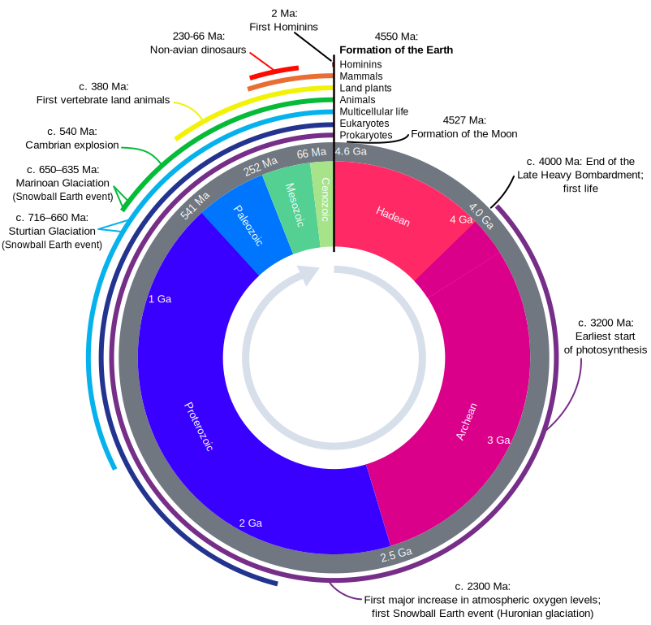
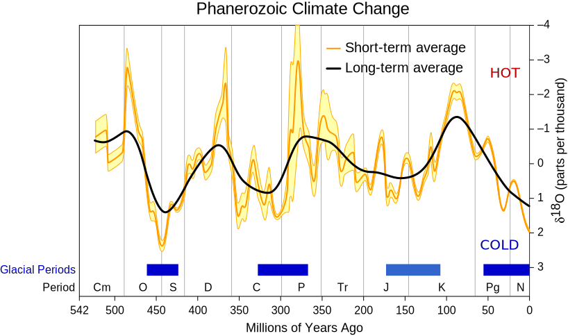
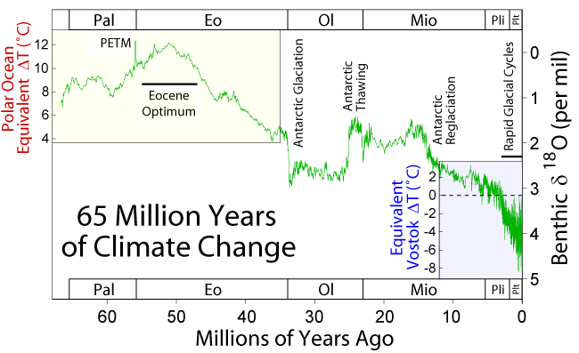
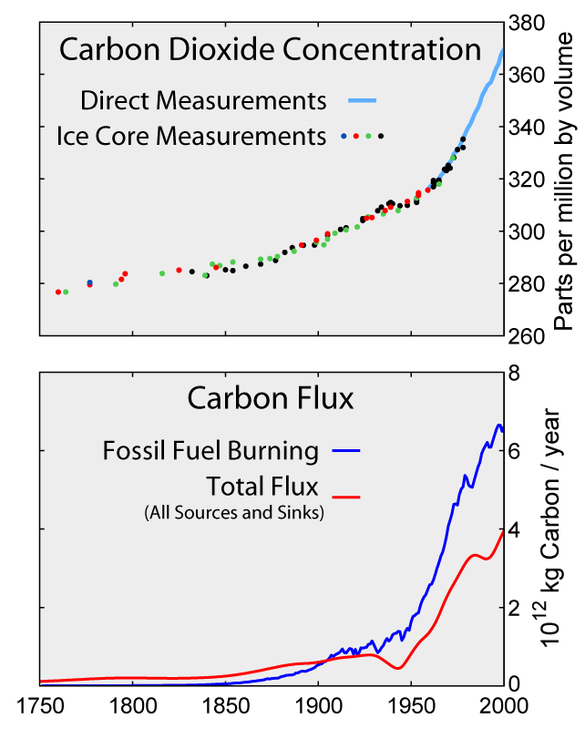

# Climate Charts

Above: The [geologic time scale](https://en.wikipedia.org/wiki/Geologic_time_scale) of the Earth.

---

Above: Estimated atmospheric oxygen over the last 3.8 billion years, on a
linear time scale, with upper and lower bounds shown.

The chart shows 5 stages:
- Stage 1: 3.85-2.45 Ga
- Stage 2: 2.45-1.85 Ga
- Stage 3: 1.85-0.85 Ga
- Stage 4: 0.85-0.54 Ga
- Stage 5: 0.54 Ga to present

There was very little atmospheric oxygen in stage 1, with a gradual increase in
stage 2, to a plateau in stage  3, a rapid increase in stage 4, continuiong to
a peak in the middle of stage 5 until finally levelling out to the present
value of 0.21 atm.

---

Above: Global temperature over the last half billion years, on a roughly
logarithmic time scale (more detail closer to the present).

Earth's temperature has mostly been well above the present, with 2 exceptions:
the [Carboniferous period](https://en.wikipedia.org/wiki/Carboniferous) about
300 million years ago, and the [Quaternary
period](https://en.wikipedia.org/wiki/Quaternary) which began over 2 million
years ago and continues. A quarter billion hot years in between. Humans only
know a world with ice caps.

---

Above: Global temperature over the last half billion years, on a linear
time scale, with glacial periods shown at the bottom.

---

Above: Atmospheric CO₂ in parts per million by volume (ppmv) over the last half
billion years, on a linear time scale.

The datasets vary widely, but they seem to agree there was less CO₂ [about 300
million years ago](https://en.wikipedia.org/wiki/Carboniferous), and [since the
Dinosaurs went extinct](https://en.wikipedia.org/wiki/Cenozoic), with much
higher CO₂ otherwise.

---

Above: Biodiversity (in thousands of genera) over the last half billion years,
on a linear time scale.

This shows biodiversity generally increasing, with a lull around the
[Triassic](https://en.wikipedia.org/wiki/Triassic) roughly 200-250 million
years ago.

---

Above: Global temperature since the dinosaurs went extinct, on a linear
time scale.

This shows temperature generally decreasing from a peak about 50 million years
go, with the Antarctic freezing, thawing, and freezing again since.

---

Above: Global temperature over the last 5 million years, on a linear time
scale.

This shows temperature generally decreasing, with rapid oscillations between
warm and cool periods, and the amplitudes increasing (maximum and minimum
temperatures spread farther apart over time).

This time scale is still too large to see recent trends.

---

Above: Global temperature over the last half million years from 3 different
sources, on a linear time scale.

This shows repeated cycles of freezing, with 5 peaks above the 20th century
global temperature average in the last 450,000 years, the [present
epoch](https://en.wikipedia.org/wiki/Holocene) being the most recent peak.

---

Above: Sea level in meters (relative to the 20th century average) over the last
20 thousand years, on a linear time scale.

This shows sea level increasing rapidly from 15 to 7 thousand years ago,
leveling out since then.

---

Above: Global temperature over the last 2 thousand years, on a linear
time scale.

This shows global temperature mostly flat with a slight bump for the [Medieval
Warm Period](https://en.wikipedia.org/wiki/Medieval_Warm_Period) and a dip for
the [Little Ice Age](https://en.wikipedia.org/wiki/Little_Ice_Age), with the
temperature going up steeply in the last century.

---

Above: Atmospheric CO₂ in parts per million by volume (ppmv) since 1750 CE.
Also, atmospheric CO₂ from fossil fuels vs. all CO₂ flux in trillions of kg.

---

Above: Global temperature change since 1900 CE due to these factors:
[sulfates](https://en.wikipedia.org/wiki/Stratospheric_sulfur_aerosols),
[volcanoes](https://en.wikipedia.org/wiki/Timeline_of_volcanism_on_Earth),
[ozone](https://en.wikipedia.org/wiki/Ozone_layer),
[sunshine](https://en.wikipedia.org/wiki/Milankovitch_cycles), and
[greenhouse gases](https://en.wikipedia.org/wiki/Greenhouse_gas).
